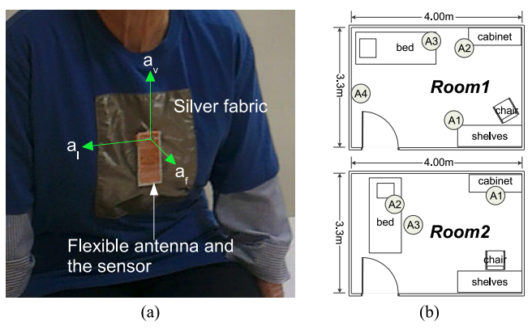
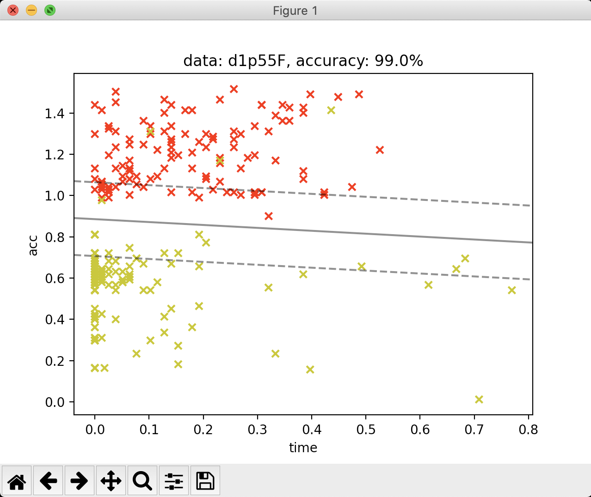
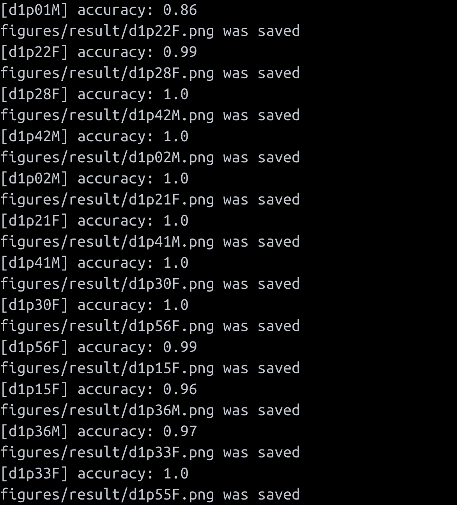

# REALTIME BED EGRESS ACTIVITIES RECOGNITION IN ORDER PEAPLE

Sequence Learning with Passive RFID Sensors for Real Time Bed-egress Recognition in Older People

This is for Assignment of MACHINE LEARNING(CSI4120-01), Park Noseong of Yonsei University.

## Project Summary

### Background

Getting out of bed and ambulating without supervision is identified as one of the major causes of patient falls in hospitals and nursing homes. An emerging generation of batteryless, lightweight, and wearable sensors are creating new possibilities for ambulatory monitoring. This data was investigated from use of a batteryless radio-frequency identification(RFID) tag response to  analyze bad-egress movements.

### Dataset Information

This dataset contains the motion data of 14 healthy order aged between 66 and 86 years old, performed broadly scripted activities using a batteryless, wearable sensor on top of their clothing at sternum level. Data is sparse and noisy due to the use of a passive sensor. Participants were allocated in two clinical room settings (S1 and S2). The setting of S1 (Room1) uses 4 RFID reader antennas around the room (one on ceiling level, and 3 on wall level) for the collection of data, whereas the room setting S2 (Room2) uses 3 RFID reader antennas (two at ceiling level and one at wall level) for the collection of motion data.



### Dependent / Independent variables

Participants wore 4 sensors attached to the chest (3 accelerometers called w2isp sensors and 1 RFID tag), and an RFID reader was installed in the room to detect signals. The measured values ​​of the three acceleration sensors and the signal strength values ​​of the RFID reader are independent variables. Participants' actual behavior is a dependent variable.

### Feature Engineering

- **Acceleration per gap with before acceleration.**

I can get clustered data, but not all datasets are satisfactory. Since the x-axis is time, the line that actually separates the two groups is drawn parallel to the x-axis. However, since it is possible to lie down on the bed several times, it is not easy to separate the two into one straight line. Therefore, if you look at the difference from the last data, you can see the instantaneous acceleration change.


## How to run

svm.py is main function, step1~3.py are a process that lead to the results of the experiment, and is not necessarily performed.

### **Mandatory parameters**

- Specific dataset file

```bash
> python3 svm.py --data {dataset filename}

# example
# > python3 svm.py --data d1p59F
# [d1p59F] accuracy: 0.99
```

- All dataset (gaining average of accuarcies)

```bash
> python3 svm.py --all

# example
# > python3 svm.py --all
# [d1p10F] accuracy: 1.0
# [d1p19F] accuracy: 0.99
# ...
# avg_accuracy: 0.9725   <- average of accuarcies
```

---

### **Optional parameters**

- Save figure(s)

```bash
# Run specific dataset file and **SAVE** figure(plot)
> python3 svm.py --data {dataset filename} --save

# example
# > python3 svm.py --data d1p59F --save
# figures/result/d1p59F.png was saved
# [d1p59F] accuracy: 0.99

# or Run All dataset files and **SAVE** each figures
> python3 step1.py --all --save

# example
# > python3 svm.py --all --save
# figures/result/d1p19F.png was saved
# [d1p19F] accuracy: 0.99
# figures/result/d1p50F.png was saved
# [d1p50F] accuracy: 1.0
# ...
# avg_accuracy: 0.9725   <- average of accuarcies
```

- Show figure(s)

```bash
# Run specific dataset file and **SHOW** figure(plot)
> python3 svm.py --data {dataset filename} --show

# or Run All dataset files and **SHOW** each figures
> python3 step1.py --all --show
```

### **Usage**

```bash
> python3 svm.py --all --save --show
```



